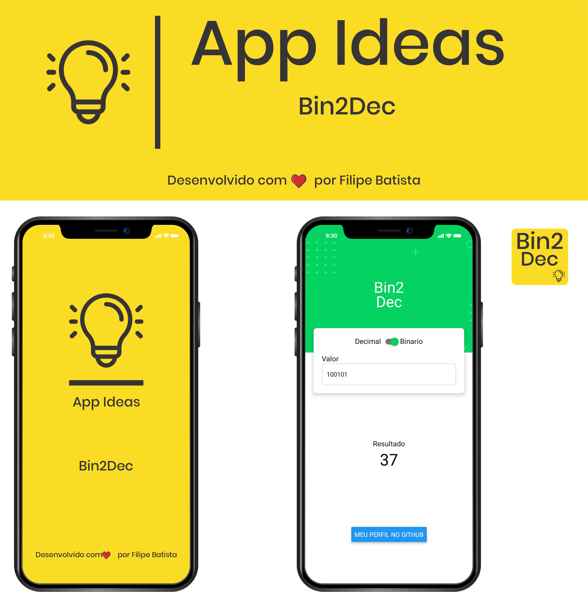

<h1 align="center"> 
     Bin2Dec - Conversor de números binários para decimais
</h1>
<hr/>

<p align="center">  
    <a href="https://www.linkedin.com/in/filipelbatista/" target="_blanc">Linkedin</a> | 
    <a href="mailto:filipe.x2016@gmail.com" target="_blanc">Gmail</a>
</p>

<hr/>

<h1>
    
</h1>

# Indice

- [Sobre](#-sobre)
- [Como baixar o projeto](#-como-baixar-o-projeto)

## 🔖&nbsp; Sobre

Projeto desenvolvido seguindo as idéias da lista <a target="_blank" href="https://github.com/florinpop17/app-ideas">App Ideas Collection</a>

---

<p align="center">  
    | App Mobile | 
</p>

---

## 🗂 Como baixar o projeto

```bash

    # Clonar o repositório
    $ git clone https://github.com/modernfunkboss/App-Ideas-Bin2Dec.git

    # Entrar no diretório desejado
    $ cd mobile

    # Instalar as dependências
    $ yarn install

    # Iniciar o projeto
    $ yarn start
```

---

<p align="center">  
    Entre em contato comigo
    <br />
    <br />
    <a href="https://www.linkedin.com/in/filipelbatista/">
        
    </a>
    &ensp;
    <a href="mailto:filipe.x2016@gmail.com">
        
    </a>
    &ensp;
    <a href="https://instagram.com/filipegaucho22">
        
    </a>
    <br />
    <br />
    Desenvolvido 💜 por Filipe Batista  
</p>

